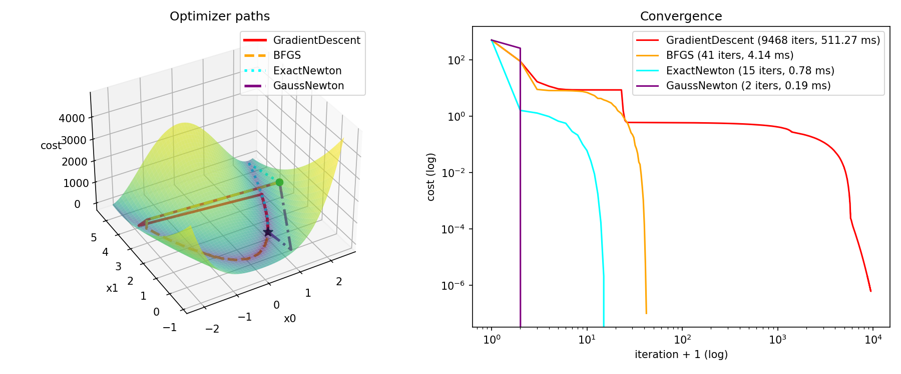
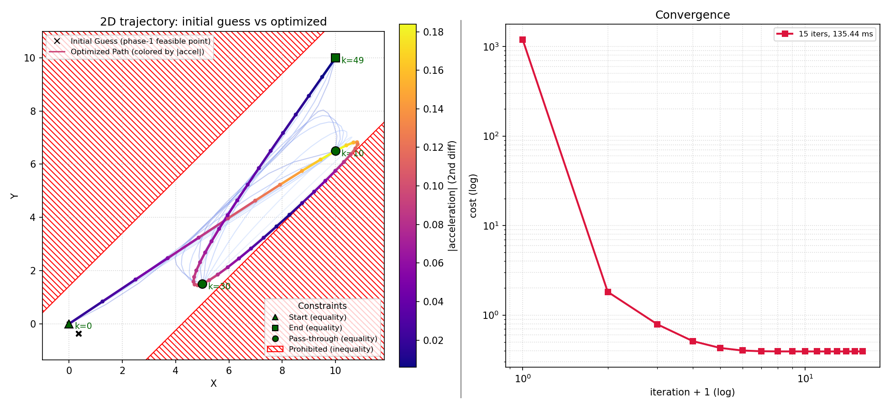

# FuriaOpt

**This project is a work in progress.**

FuriaOpt is a C++ optimization library designed to solve NLP, LS, QP, and LP problems, with or without linear and non-linear constraints.

## Features
*   **Solvers:** NLP (Gradient Descent, BFGS, Exact Newton), LS (Gauss-Newton), QP/LP (primal log-barrier interior-point method), and SQP for nonlinearly-constrained NLPs.
*   **Constraints:** Supports both linear and non-linear constraints.
*   **Testing:** Includes a comprehensive suite of unit tests.
*   **Examples:** Demonstrations on how to integrate and use the solvers.
*   **Visualizer:** To visualize iterations of the solvers on provided examples.

## Requirements
*   C++20 or higher
*   CMake
*   Eigen 3
*   Catch2 (for testing)
*   spdlog (for logging)
*   nlohmann_json (for config loading)

## AI Usage Disclosure
During development, Claude Code (Anthropic Opus and Sonnet family models) was used as an engineering assistant for:
*   Code REVIEW of the solver components, no direct modifications.
*   Generation of unit and integration tests.
*   Refinement of examples and python visualizers.

The fundamental concepts, algorithms, and implementation strategy originate from the author's prior knowledge, refer to the background section.

## Background
- Constrained Numerical Optimization for Estimation and Control (CNOEC), Lorenzo Fagiano, Politecnico di Milano.

## Examples

### Unconstrained NLP
The chosen example for Unconstrained NLP problem solving is the classic Rosenbrock problem, comparing Gradient Descent, BFGS, Exact Newton and Gauss-Newton all from the same random starting point:

$$f(x_0, x_1) = (a - x_0)^2 + b(x_1 - x_0^2)^2, \quad a = 1,\ b = 100$$

### Constrained QP
Smooths a 2D path pinned at unevenly-spaced waypoints, confined to a straight corridor around the start-end line:

$$\min_{u}\ \tfrac12\sum_{d\in\{x,y\}}\lVert Du_d\rVert_2^2 \quad\text{s.t.}\quad u_k = p_k\ (k\in\mathcal A), \quad -w_r \le n^\top u_k \le w_\ell\ \ \forall k$$

$D$ is the discrete 2nd-difference operator, $(Du)_i = u_{i-1} - 2u_i + u_{i+1}$, a finite-difference approximation of acceleration at unit time steps; $A=\{0,10,30,49\}$ are the pinned waypoints, $n$ the corridor normal. We don't supply $x_0$: the solver computes its own strictly feasible starting point via an internal phase-1 QP.

## License
This project is licensed under the [MIT License](LICENSE).